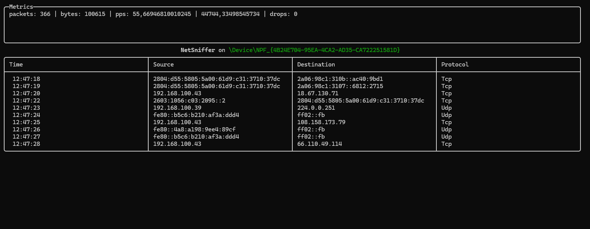

# PacketSniffer CLI

[](https://dotnet.microsoft.com/)
[](https://spectreconsole.net/)
[](https://github.com/dotpcap/sharppcap)
[](https://github.com/chmorgan/packetnet)
[](https://serilog.net/)

The project was built using Spectre.Console and SharpPcap to capture packets from network interfaces and display source, destination, and protocol information.

In this project some good practices were applied and Queue-based methods were used to improve memory management under high load when capturing many packets.



---

## Dependencies

This project requires libpcap. On Windows you should install Npcap (https://npcap.com/). On Linux, install libpcap via your distribution package manager.

---

## Build

Run `dotnet build` to build the solution.

---

## Run

From a terminal or CMD:

```bash
dotnet run --project PacketSniffer
```

You can pass a BPF filter (the same syntax used by Wireshark):

```bash
dotnet run --project PacketSniffer --filter "tcp port 80"
```

---

## Issues and Improvements

- [ ] Add port column to the table
- [ ] Improve memory management for long-running sessions
  - [ ] Metrics
- [ ] Improve UI with colors for local IP addresses
- [ ] Show the active filter if one is provided
- [ ] Generate a log file per session when `-o` is passed
- [ ] Stop / Resume actions during capture
- [ ] Error handler

---

## Notes

- Target framework: .NET 8 (net8.0)
- Packages referenced (from `PacketSniffer.csproj`): PacketDotNet 1.4.8, SharpPcap 6.3.1, Spectre.Console 0.52.0, Serilog 4.3.0, Serilog.Sinks.Console 6.0.0
